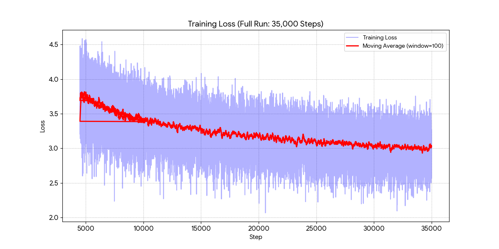

# NetNet Foundation Model

## Setup

    source .venv/bin/activate
    cd 00_foundation
    pip install -r requirements.txt

    # Create fineweb_data.jsonl
    python download_data.py

    # Create model.pt, training_loss.csv
    python train.py

    python inference.py

If you stop training, you can resume it by running `python train.py` again.
The latest checkpoint will be loaded automatically.

The training run takes about 12 hours on an M2 Max with 64GB RAM (Mac Studio).

Edit `config.py` to optimize for your hardware.

## Training

We trained the model for 35,000 steps.

Here are the stats from your final run:

Final Loss: ~3.01 (Average of last 500 steps)

Minimum Loss: 2.07 (Single best batch)

Convergence Status: Diminishing Returns Hit.

At the end, your improvement slowed to just -0.013 loss per 1,000 steps.